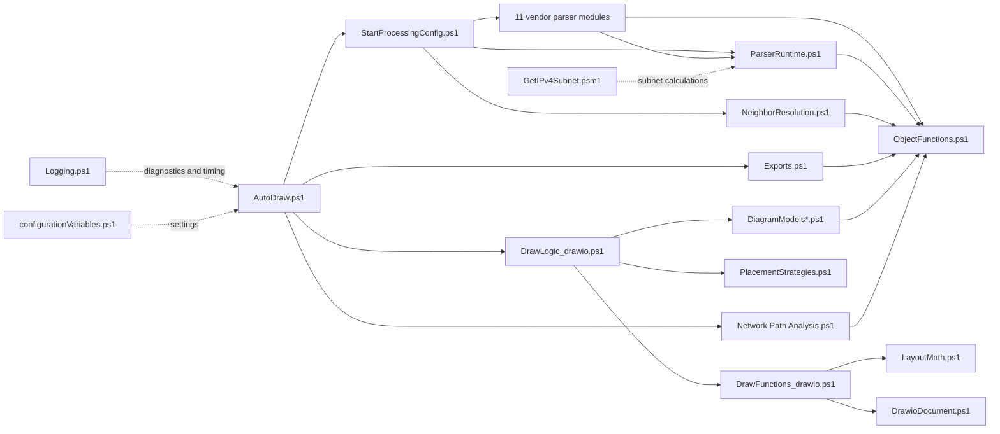
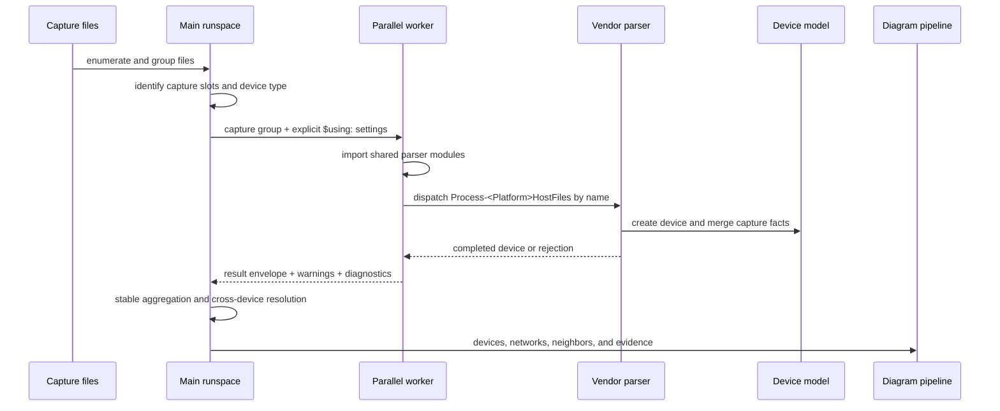

# MTAutoDraw architecture

MTAutoDraw converts network-device command captures into an in-memory network model, then renders
Draw.io documents and structured exports. This document describes the runtime boundaries and the
contracts contributors need to preserve.

## Runtime flow

`AutoDraw.ps1` owns the run from argument validation through the final process exit code.

```mermaid
flowchart TD
    Start["AutoDraw.ps1 arguments"] --> Paths["Validate input and output paths<br/>start transcript"]
    Paths --> Load["Load 17 project libraries<br/>and GetIPv4Subnet.psm1"]
    Load --> Runtime["Validate Python and TextFSM.py<br/>load MAC vendor mapping"]
    Runtime --> Find["Find *.txt captures recursively"]
    Find --> Group["Create-FileHostObjects<br/>group captures and map command slots"]
    Group --> Process["Start-ProcessingFiles<br/>classify, parse, aggregate, resolve"]
    Process --> Evidence["Build topology-evidence model"]

    Evidence --> ExportGate{"$GExportData"}
    ExportGate -->|true| Exports["Write CSV and JSON exports"]
    ExportGate -->|false| AnalysisGate
    Exports --> AnalysisGate{"$GNetworkTracePathAnalysis"}
    AnalysisGate -->|true| Analysis["Run experimental path analysis"]
    AnalysisGate -->|false| DrawGate
    Analysis --> DrawGate{"diagram toggles"}
    DrawGate -->|enabled pages| Draw["Build page models<br/>place and render shapes"]
    DrawGate -->|no pages| Summary
    Draw --> Save["Save multi-device and/or singles .drawio files"]
    Save --> Summary["finally: write RunSummary.json<br/>print verdict and set exit code"]

    classDef decision fill:#fef3c7,stroke:#b45309,color:#78350f
    classDef action fill:#dbeafe,stroke:#1d4ed8,color:#1e3a8a
    classDef terminal fill:#dcfce7,stroke:#15803d,color:#14532d
    class ExportGate,AnalysisGate,DrawGate decision
    class Start,Paths,Load,Runtime,Find,Group,Process,Evidence,Exports,Analysis,Draw,Save action
    class Summary terminal
```

The `finally` block always attempts to write `RunSummary.json`, even after a fatal exception. Exit
code `0` represents a pass or warning verdict, `1` means captures did not produce the required
device model, and `2` means the run failed fatally.

## Subsystem boundaries

The arrows show ownership and data dependencies rather than every individual function call. The
generated call graph provides the exact static call relationships.

The important boundaries are:

- Vendor modules translate captures into the shared object model. They do not discover files,
  render pages, or write exports.
- Diagram-model functions decide what a page contains. Drawing functions consume those models and
  handle geometry and presentation.
- `DrawFunctions_drawio.ps1` defines shapes, but `Add-DrawioCell` is the only function that emits an
  `mxCell`. `DrawioDocument.ps1` owns the document buffer and page lifecycle.
- `configurationVariables.ps1` contains user settings. Fixed implementation constants should stay
  beside the code that uses them.

## Parallel parsing boundary

Each capture group is parsed in an isolated PowerShell runspace. Workers cannot rely on variables or
modules from the main runspace unless `StartProcessingConfig.ps1` explicitly provides them.

Two rules prevent silent worker failures:

1. Any configuration value read by a vendor parser must be copied through the `$using:` initialization
   block in `StartProcessingConfig.ps1`.
2. Any function used by a worker must come from a module imported inside the parallel block. A module
   loaded by `AutoDraw.ps1` is not automatically available in a worker.

Diagnostics inside workers must use `Write-MTAutoDrawLog -Device` or
`Write-MTAutoDrawDiagnostic -Device`. These calls append structured records to the device; the main
runspace filters and prints them after aggregation, keeping concurrent output attributable.

## Parser contract

Every vendor module declares `# MTAutoDraw-Standard: v1` and contains one
`Process-<Platform>HostFiles` orchestrator. Capture readers use the same guard, extract, map, and
merge structure and accept `-Device` plus a nullable `-Path`. See
[`PARSER_STANDARD.md`](../PARSER_STANDARD.md) for the complete contract and new-platform checklist.

## Diagram contract

A diagram page follows this sequence:

1. Obtain a model from `DiagramModels.ps1`, `DiagramModels.Layer3.ps1`, or
   `DiagramModels.Pages.ps1`.
2. Handle an empty model with an explanatory page rather than a blank page.
3. Measure and place nodes before drawing connectors.
4. Draw connectors only after both endpoint IDs are registered on the current page.
5. Add a scope note explaining what the page includes and where omitted detail is available.
6. End the page through `DrawioDocument.ps1`.

Shape functions return their emitted ID and measured dimensions. Layout code therefore works from
the same footprint the renderer uses. Labels are HTML-encoded exactly once in `Add-DrawioCell`.
